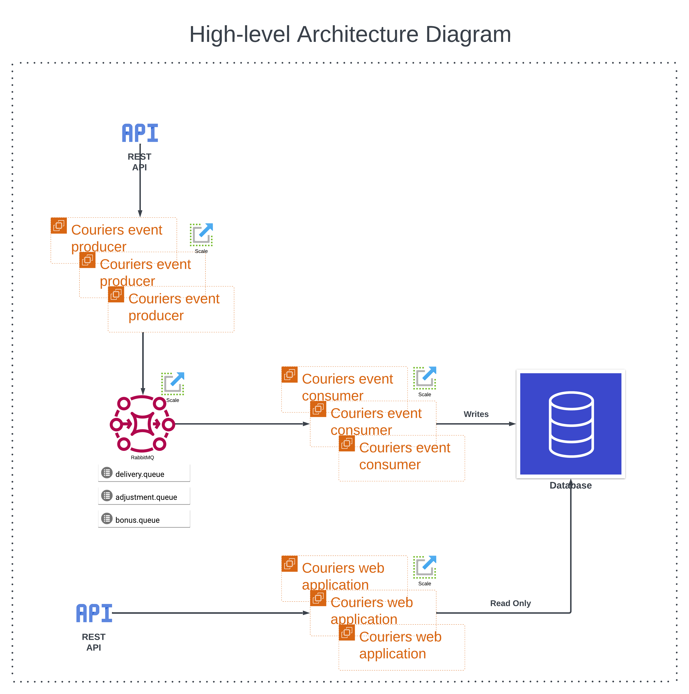
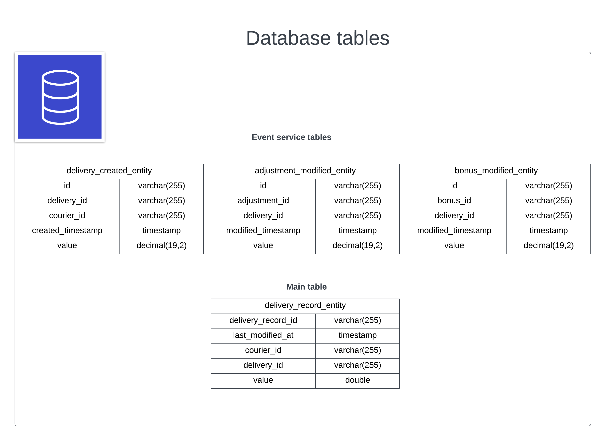
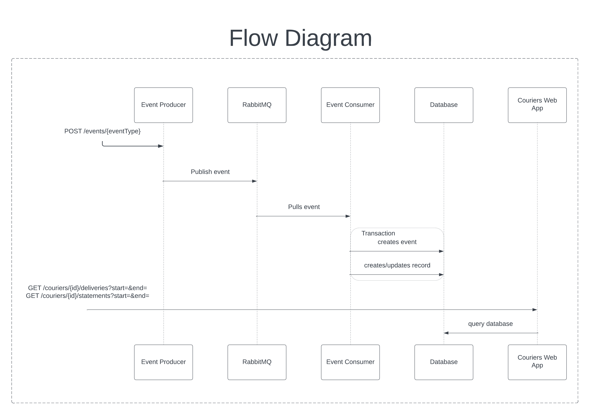

## Courier Statements and Deliveries System
Application consists of 6 modules:
- couriers-api - shared module which describes API in openAPI format.
- couriers-persistence - shared module for DB communication.
- couriers-web-app - main application which exposes REST API to query delivery transactions and courier statements. Includes integration tests.
- couriers-web-impl - implementation and configuration for main application.
- couriers-event-producer - application which exposes REST API to submit events per documentation.
- couriers-event-consumer - application which listens for events from RabbitMQ and writes to DB.

### Pre-requirements

1. Docker need to be installed

### Running

To run application:

1. overwrite environment variables in `.env` if you'd like, or keep them as is
2. `docker-compose up -d --build`
3. Main application is accessible on port `8080` to query delivery transactions and weekly courier statement
   [swagger UI by link](http://localhost:8080/swagger-ui/index.html?configUrl=/v3/api-docs/swagger-config#/)
4. Event producer application is accessible on port `8081` to produce events
   [swagger UI by link](http://localhost:8081/swagger-ui/index.html?configUrl=/v3/api-docs/swagger-config#/)
5. RabbitMQ Management UI is available
6. [by link](http://localhost:15672/#/queues)

To pull up the code changes rebuild the image with:

1. `docker-compose up -d --build`

### Request examples

#### 1. Submit delivery event
```
curl -X 'POST' \
  'http://localhost:8081/events/delivery' \
  -H 'accept: application/json' \
  -H 'Content-Type: application/json' \
  -d '{
  "courierId": "courier",
  "value": 5.66
}'
```

#### 2. Submit adjustment event
```
curl -X 'POST' \
  'http://localhost:8081/events/adjustment' \
  -H 'accept: application/json' \
  -H 'Content-Type: application/json' \
  -d '{
  "deliveryId": "<output_id_from_previous_step>",
  "value": 7.22
}'
```

#### 3. Submit bonus event
```
curl -X 'POST' \
  'http://localhost:8081/events/bonus' \
  -H 'accept: application/json' \
  -H 'Content-Type: application/json' \
  -d '{
  "deliveryId": "<output_id_from_step_1>",
  "value": 3.33
}'
```

#### 4. Get delivery transactions for provided timeframe (modify your dates accordingly)
```
curl -X 'GET' \
  'http://localhost:8080/couriers/courier/deliveries?start=2023-04-15%2000%3A34%3A57&end=2023-04-16%2014%3A54%3A57' \
  -H 'accept: application/json'
```
Response example:
```json
{
  "courierId": "courier",
  "from": "2023-04-15 00:34:57",
  "to": "2023-04-16 14:54:57",
  "numberOfTransactions": 2,
  "deliveries": [
    {
      "sum": 4.97,
      "deliveryId": "0fc77fb0-f620-4357-907f-317804550e94"
    },
    {
      "sum": 16.21,
      "deliveryId": "c94d98bd-904b-4991-87ed-81019d0a21d7"
    }
  ]
}
```

#### 5. Get courier statement
```
curl -X 'GET' \
  'http://localhost:8080/couriers/courier/statements' \
  -H 'accept: application/json'
```
Response example:
```json
{
  "sum": 21.18,
  "statementIds": [
    "e37cf535-fde1-4d0d-a0fa-82646abef9e4",
    "e70f9328-6eda-4793-87b7-a61587bf0b29"
  ],
  "deliveryIds": [
    "0fc77fb0-f620-4357-907f-317804550e94",
    "c94d98bd-904b-4991-87ed-81019d0a21d7"
  ]
}
```

### Diagrams
Some of the diagrams were removed due to limitations of free account.

[Lucidchart Diagram Source](https://lucid.app/lucidchart/ed9861e2-98f9-48c6-8a12-716969f75cd6/edit?invitationId=inv_d20166f5-f5fa-452b-9943-c0ce49444b44)

## High-level architecture


## Database design


## Flow diagram


### TODO
- mapstruct for auto-mapping
